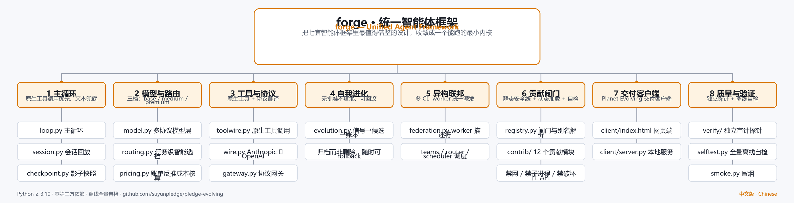
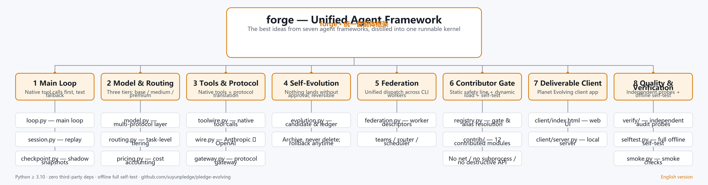

# 项目结构图谱 / Project Tree Map





## 中文

```text
forge 统一智能体框架（仓库 pledge-evolving）
├── 主循环 Main Loop ── 原生工具调用优先、文本兜底（loop.py · session.py · checkpoint.py）
├── 模型与路由 Model & Routing ── base / medium / premium 三档（model.py · routing.py · pricing.py）
├── 工具与协议 Tools & Protocol ── 原生工具 + Anthropic ↔ OpenAI 协议翻译（toolwire.py · wire.py · gateway.py）
├── 自我进化 Self-Evolution ── 无批准不落地、写入必带出处、可回滚（evolution.py）
├── 异构联邦 Federation ── 多 CLI worker 统一派发与成本护栏（federation.py）
├── 贡献闸门 Contributor Gate ── 静态安全线 + 动态加载 + 自检（registry.py · contrib/）
├── 交付客户端 Client ── Planet Evolving 交付客户端（client/）
└── 质量与验证 Quality & Verification ── 独立探针 + 全量离线自检（verify/ · selftest.py）
```

## English

```text
forge — Unified Agent Framework (repo: pledge-evolving)
├── Main Loop ── native tool calls first, text fallback (loop.py · session.py · checkpoint.py)
├── Model & Routing ── three tiers: base / medium / premium (model.py · routing.py · pricing.py)
├── Tools & Protocol ── native tools + Anthropic ↔ OpenAI translation (toolwire.py · wire.py · gateway.py)
├── Self-Evolution ── nothing lands without approval, traceable and reversible (evolution.py)
├── Federation ── unified dispatch across CLI workers with cost guardrails (federation.py)
├── Contributor Gate ── static safety line + dynamic load + self-test (registry.py · contrib/)
├── Client ── Planet Evolving deliverable client (client/)
└── Quality & Verification ── independent probes + full offline self-test (verify/ · selftest.py)
```

> 图谱由脚本按仓库真实目录生成，随代码结构变化重新生成即可。
