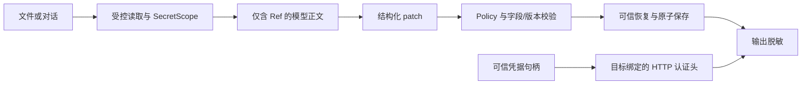

# Secret Virtualization 结构复审

日期：2026-10-08。审查基线：`ae74eac` 加当前未提交工作区。

本轮独立读取实际实现、配置加载格式和调用链，使用合成凭据补失败测试，再做局部修复。
没有读取用户 Secret Store 的内容，没有发起付费厂商请求。

## 结论

当前设计具有清晰的入口：文件/消息虚拟化、结构化配置编辑、最后阶段 HTTP 认证、输出脱敏。
原实现的测试没有覆盖实际 Forge 配置行、特殊 Secret 容器及完整 LogRecord，导致若干安全承诺强于实现。
本轮修复下面可复现的问题，并保留已有 Policy/read-scope、插件生命周期和 UI 实现。

安全保证应限定为：**受保护 Agent 使用受控工具时，已识别或预注册的 Secret 被隔离于模型正文和工具输出；SecretRef 的解析仅由可信配置写入/认证组件完成。**
Authorization/x-api-key 必须携带真实凭据才能认证；它们不属于发给模型的对话 JSON。
不可信同进程 Python、同账户恶意进程、未知无标记 Secret 的完备识别，不在当前保证内。

## 本轮发现与修复矩阵

| 级别 | 场景 | 修复前实际行为 | 风险 | 本轮修复 | 自动化覆盖 |
|---|---|---|---|---|---|
| P1 | Forge 原生配置行 `{id: policy, config: ...}` | 校验只找名为 policy/sandbox 等的字典键，`config.allow` 能被改写 | 后续加载配置时扩大权限；与新增 readScope 接线不一致 | 按行 id/name 识别权限与工具控制行，整行冻结，覆盖禁用、移除、重命名及追加覆盖行 | `test_real_forge_policy_row_cannot_be_escalated`，并验证普通 model 行仍能改 |
| P1 | 添加启动期 `$expr` 表达式 | 普通字段允许插入 `get('env.FORGE_...')` | 后续启动求值可越过普通配置数据边界，读取环境；本轮不执行恶意表达式 | 将 `$expr` 纳入宿主控制字段，禁止 Agent 添加/改变/删除 | `test_agent_cannot_add_boot_time_environment_expressions` |
| P1 | `$` 开头密码、夹带假 SecretRef 的密码 | 文本检测跳过；结构化检测跳过所有 `$` 开头值 | 真实值直接进入受保护视图 | 仅完整有效 Ref/遮盖标记保留，其他已声明敏感值统一虚拟化；写回保留原字节值 | `test_declared_secrets_cannot_opt_out_with_dollar_or_ref_substring` |
| P1 | access_token/password/cookies 的列表和嵌套映射 | 部分标记未下传到标量叶节点 | 非标准厂商凭据漏检 | 敏感字段的容器传播保护，标量叶节点产生 Ref | `test_declared_secret_containers_protect_scalar_leaves` |
| P1 | Secret 先出现在普通描述、后出现在 password 字段 | 单次从前往后扫描留下先前的原文 | 检测结果取决于字段顺序 | 本次遍历发现新敏感值时，对结果再检查；已有稳定视图不固定重复扫描 | `test_sensitive_mapping_is_independent_of_field_order` |
| P1 | 日志 extra 的键本身含 Secret、已缓存 exc_text | 清洗后的键覆盖写入，原键仍保留；缓存异常文本未清洗 | JSON logger/第二个 handler 泄漏 | 替换整个 extra 集，清洗缓存异常文本 | `test_log_record_renamed_keys_and_cached_trace_are_not_retained` |
| P1 | 日志脱敏抛异常 | 只替换 message，保留原始 extra | 失败处理路径反而泄漏 | 删除 extra，清空异常/堆栈，标准文本字段只留标记 | `test_log_redaction_failure_does_not_keep_original_extras` |
| P1 | 日志额外对象、logger/path 等标准元数据 | 对象在下游 default=str 才展开，标准字段未过滤 | 结构化日志可绕过 message 清洗 | 有界地将对象转为日志数据后脱敏，并清洗标准文本字段 | `test_structured_log_objects_and_standard_metadata_are_safe` |
| P2 | 大文件进入检测器/edit_config | 先 read_text/read_bytes 整个文件，之后才检查大小 | 内存突增、Gateway/GUI 长时间无响应 | 统一有限读取：最多 limit+1 字节；普通检查 8 MiB，配置编辑及提交 CAS 1 MiB | `test_full_file_inspection_does_not_make_an_unbounded_read` |

新增测试位于 `forge/test_secret_architecture.py`，9 个测试方法。所有负例均在修复前运行并观察到失败。
首批 5 项、第二批 3 项、表达式 1 项分批完成，避免把修复后的通过误写成预先已有保障。

## 结构与边界复核

- `SecretScope` 不提供面向模型的 resolve/list/export 工具；Policy 对 resolve/export 有独立硬拒绝。
- `edit_config` 检查文件版本、字段、引用位置和目的地；配置控制不能仅用“字段看起来像密码”的检测处理。
- Agent/Gateway 创建 `isolated=True` 的 ToolContext；受保护原生插件在导入/运行前拒绝，声明式插件仍由 Gateway Policy 判定。
- HTTP 凭据句柄检查目的主机及 TLS，专用 opener 拒绝重定向；请求正文再次经过虚拟化。
- 此次补充的实际配置行测试包含 readScope，但没有修改另一个 agent 的 Policy/read-scope 实现。
- 审查前后 HEAD 均为 `ae74eac`。共享工作区没有作者级隔离，本轮没有 reset、checkout、提交或覆盖整套工作区；只能确认观察到的文件状态，不能保证外部编辑器今后不会再修改它。

## 仍需明确保留的工程限制

这些是当前实现的边界或后续结构工作，本轮没有把它们描述为已经完成的功能。

1. **全局脱敏注册表生命周期（P2）**：`_KNOWN/_NUMERIC_VALUES` 在进程内共享，关闭 scope 只撤销映射；原值及编码变体仍留在脱敏注册表。16 MiB 累积上限可以导致长驻进程拒绝后续内容。短值/数字也可能遮盖无关的同值业务数据。后续需要按活跃请求/持久化出口管理生命周期、配额和协议元数据；不能简单清空集合，否则迟到日志可能泄漏。
2. **默认值与宿主责任（安全边界）**：底层 ToolContext 默认 `isolated=False`，原生插件也有可信宿主 opt-out。生产 Agent/Gateway 已显式开启保护，但嵌入者必须遵守这个契约。私有 Python 方法/对象不构成同进程恶意代码隔离。
3. **跨进程 Ref（功能边界）**：GUI scope 与 Gateway scope 是不同内存存储；共享 session 标识不复制 Secret 映射。引用可展示、携带；要使用/恢复它必须由拥有映射的可信组件完成。没有实现可跨进程传输映射的授权 broker。
4. **本地存储与文件竞争（安全边界）**：GUI 的既有 Secret 文件仍是本地明文。路径/符号链接/硬链接检查以及配置锁不等于 OS 隔离；外部进程不遵守锁时存在检查到使用之间的竞争窗口。凭据保险库和基于文件句柄的边界属于后续工作。
5. **检测与协议范围（保证范围）**：未知无标记字符串、任意自定义编码、未经受控工具注册的执行扩展不能获得无条件不泄漏承诺。所有扩展注册和原生执行的入口必须继续被当作可信计算部分审计。

这些限制使当前实现适合在已有受控执行约束下继续验证。启用不可信原生插件之前，必须先具备独立进程/OS 沙箱与授权凭据 broker。

## 回归结果

| 本轮执行 | 结果 |
|---|---|
| `forge.selftest` | 569 / 569 |
| Secret 新旧测试 + execution_review + model_adaptation | 103 / 103 |
| GUI Secret、交互、Client、Sub-Agent、Provider 适配 | 48 / 48 |
| 插件 runtime、adversarial、capabilities | 94 / 94 |
| 新增 read-scope 功能 | 31 / 31 |
| `git diff --check` | 通过；仅已有 CRLF 提示 |

最后一项表达式保护只改配置校验，随后重跑包含新旧 Secret/配置测试的 103 项；核心/GUI/插件结果来自该一行收紧之前。
本轮没有重新执行付费 T10；此前报告中的厂商请求结果属于此前的验证，不计入本轮。

本轮实现文件仅修改 `forge/secrets.py`、`forge/config_edit.py`、`forge/tools.py`；新增本报告及独立回归测试。
没有修改 UI 风格、打包、生成 EXE 或创建代码副本。
